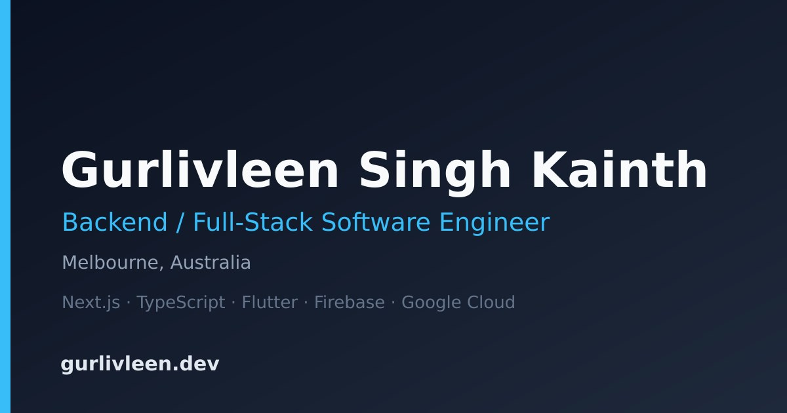

<div align="center">

# gurlivleen.dev

**Personal portfolio of Gurlivleen Singh Kainth** — a Melbourne-based backend /
full-stack software engineer.

[**Live → gurlivleen.dev**](https://gurlivleen.dev) &nbsp;·&nbsp;
[LinkedIn](https://www.linkedin.com/in/gurlivleen2000/) &nbsp;·&nbsp;
[GitHub](https://github.com/gurlivleenkainth2000) &nbsp;·&nbsp;
[Résumé](./public/resume.pdf)


<br />



</div>

---

## About

A fast, accessible portfolio built on the Next.js App Router. It presents project
case studies, a résumé, skills, and achievements, with a working contact form and
careful SEO (per-route metadata, structured data, sitemap). The codebase doubles
as a reference for how I structure a modern Next.js app — see [`docs/`](./docs).

## Highlights

- **Project case studies** — a `/projects` index plus per-project detail pages
  (`/projects/[slug]`), statically generated from typed content records.
- **Contact form** — client-side validation, a hidden honeypot, and server-side
  delivery via Resend; receiving handled by Cloudflare Email Routing.
- **SEO done properly** — every route owns its keywords + Next.js `Metadata`,
  with `sitemap.ts`, `robots.ts`, and JSON-LD structured data (`Person`,
  per-project `CreativeWork`, and `BreadcrumbList` trails).
- **Polished UX** — light / dark theming, a responsive navbar with active-route
  highlighting and an animated mobile menu, and Framer Motion entrance
  animations throughout.

## Tech stack

| Layer | Technology |
|-------|-----------|
| Framework | Next.js 16 (App Router, Turbopack) |
| Language | TypeScript 5 (strict) |
| UI | HeroUI v2 + Tailwind CSS 4 + Tailwind Variants |
| Animation | Framer Motion |
| Theming | next-themes (class-based light / dark) |
| Forms / email | react-hook-form + Resend |
| Hosting | Firebase App Hosting |
| DNS / email routing | Cloudflare |

## Getting started

```bash
# 1. install
npm install

# 2. configure env (contact form)
cp .env.example .env.local   # then fill in the values

# 3. run
npm run dev                  # http://localhost:3000
```

### Environment variables

The contact form needs three variables (documented in `.env.example`):

| Variable | Purpose |
|----------|---------|
| `RESEND_API_KEY` | Resend API key used to send mail |
| `CONTACT_FROM_EMAIL` | Verified sender on `gurlivleen.dev` |
| `CONTACT_TO_EMAIL` | Where submissions are delivered |

Full setup (Resend domain verification, Cloudflare Email Routing, and the
production secret) is in **[docs/contact.md](./docs/contact.md)**.

### Scripts

| Command | Description |
|---------|-------------|
| `npm run dev` | Start the dev server (Turbopack) |
| `npm run build` | Production build |
| `npm run start` | Serve the production build |
| `npm run lint` | ESLint with `--fix` |

> Use **Node 22 LTS** — newer odd releases (e.g. Node 25) break the Firebase CLI.

## Project structure

```
app/                 # App Router routes
  (about)/           # route group: resume, skills, achievements
  about/  contact/  blog/  projects/[slug]/
  api/contact/       # contact form route handler (Resend)
  sitemap.ts  robots.ts
components/           # shared UI (navbar, icons/, json-ld, motion, feature groups)
config/              # tunable settings (site.ts = single source of truth, fonts.ts)
data/                # domain content records (experience, education, projects, skills)
metadata/            # per-route SEO + JSON-LD builders, imported via @/metadata
types/               # TypeScript interfaces, one file per domain
docs/                # architecture, routing, and SEO guides
```

## Documentation

In-depth guides live in [`docs/`](./docs):

- [architecture.md](./docs/architecture.md) — rendering model, directory
  responsibilities, the config/data/metadata separation, and cross-cutting
  systems (icons, structured data, theming, animation).
- [routing.md](./docs/routing.md) — route tree, route groups, the client-page
  metadata pattern, and dynamic `[slug]` routes.
- [seo.md](./docs/seo.md) — metadata + the Next.js inheritance model, keyword
  strategy, JSON-LD, and `sitemap` / `robots`.
- [deployment.md](./docs/deployment.md) — local setup, the fork checklist, and
  Firebase App Hosting deployment.

Conventions for contributors and AI assistants are in [CLAUDE.md](./CLAUDE.md).

## Deployment

Deployed on **Firebase App Hosting** (`apphosting.yaml` + `firebase.json` +
`.firebaserc`), auto-building from `main`. `RESEND_API_KEY` lives in Cloud Secret
Manager; the other env vars are plain values. Full walkthrough — including the
fork/clone checklist and custom-domain setup — is in
[docs/deployment.md](./docs/deployment.md).

## License

The source code is released under the [MIT License](./LICENSE). The written
content, project case studies, brand assets, and résumé are © Gurlivleen Singh
Kainth and are not covered by MIT (see [NOTICE](./NOTICE)).
